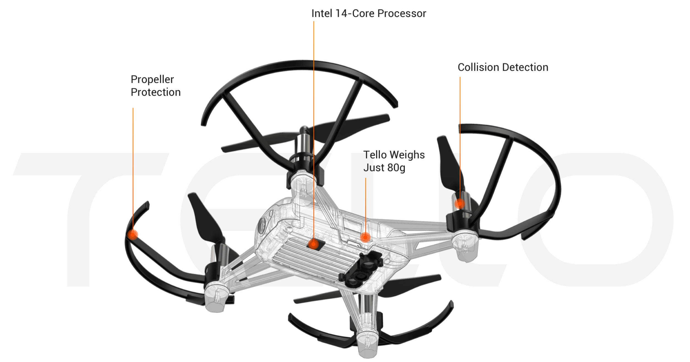

# Exploring Drone Technology & Cybersecurity
Hardware Explanation 

CPU: Intel 14 Core Processor
- This is the brains of the system and where the real magic happens.

- 4 tiny propellors 
- 4 bump guards 
- battery charger port connected with micro usb
- x1 battery 
- Has WiFi enabled NIC with SSID Broadcast no security enabled

Software & Networking Exploration
- Runs DHCP server that leases out 192.168.10.0/24 network
- Fantastic demonstration of connecting to Tello Drone: https://www.youtube.com/watch?v=kcXN7CYgQ0g
- The Tello SDK is written in Python
- [dji-sdk/Tello-python GITHub Repo](https://github.com/dji-sdk/
Tello-Python)

- NMAP scan shows: Running Abyss webserver port: 9999 
Requirements: 
- Computer Hardware  (Laptop, Desktop or Raspberry Pi) (tested with windows)
- WiFi 
- python
- [Tello SDK](https://terra-1-g.djicdn.com/2d4dce68897a46b19fc717f3576b7c6a/Tello%20%E7%BC%96%E7%A8%8B%E7%9B%B8%E5%85%B3/For%20Tello/Tello%20SDK%20Documentation%20EN_1.3_1122.pdf)
    -This to a .py file that is a UDP client that should allow us to send commands to the drone

- Need to learn how to control drone with a graphical interface. Also need a way to connect to camera.
- 
