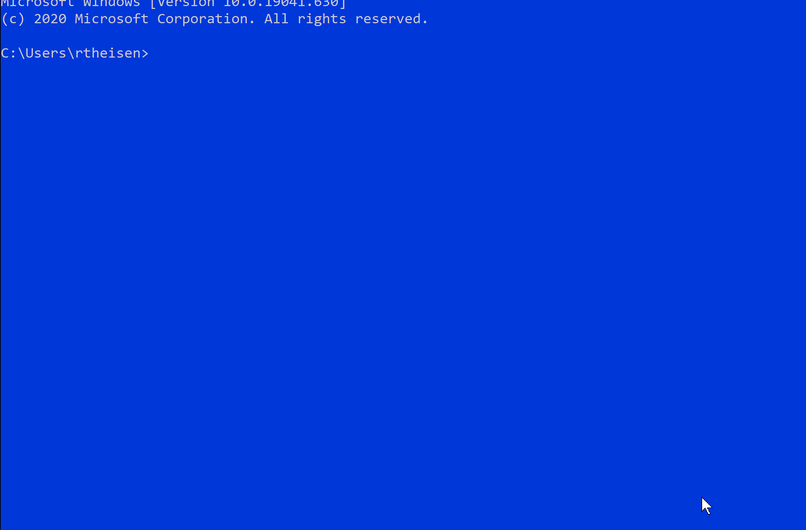
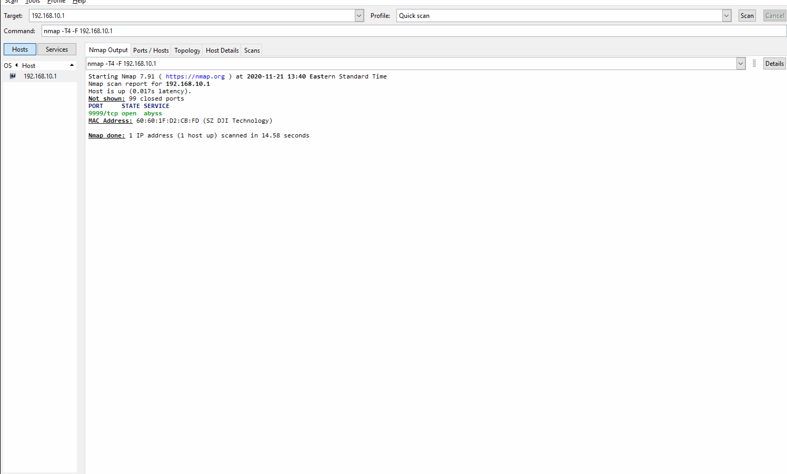

# Exploring Drone Technology & Cybersecurity
## Hardware Explanation 

CPU: Intel 14 Core Processor
- This is the brains of the system and where the real magic happens.

5 Megapixel camera 
- Allowing for high quality images and videos - 4 tiny propellors 
- 4 propeller guards 
    - Crashing is inevitable! 
- 1 battery charger port connected with micro usb
- 1 1.1Ah/2.8 volt battery 
- Maybe one day Tesla will make a battery that can fit this and last longer in flight
- Has WiFi enabled NIC with SSID Broadcast no security enabled out-of-box.

## Software & Networking Exploration
The Tello Drone runs a DHCP server that leases out IP addresses on the 192.168.10.0/24 network. 

Checking my ip address and sending a ping icmp echo-request message to my drone

- [Fantastic demonstration of connecting to Tello Drone](https://www.youtube.com/watch?v=kcXN7CYgQ0g)
- The [DJI-SDK/Tello-python repo](https://github.com/dji-sdk/Tello-Python) is hosted on GitHub and has many nifty python kits to learn programming in a comprehensive way
- [NMAP](https://nmap.org/) scan shows: 
Running Abyss webserver port: 9999 

 
In Progress: 
- Need to learn how to control drone with a graphical interface. Also need a way to connect to camera.
    - Currently working to get [Drooone Windows app](https://www.microsoft.com/en-us/p/drooone/9n0z6wvt0w6n?activetab=pivot:regionofsystemrequirementstab) working    

